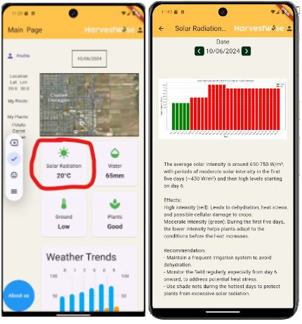
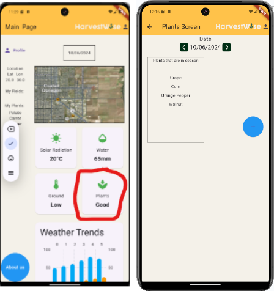
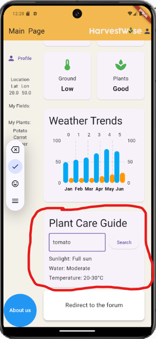

**High-Level Summary**

In response to the growing challenges faced by farmers due to climate variability, HarvestWise is an innovative application designed to provide agriculturists with essential insights into environmental conditions that directly impact their crops and land. This tool bridges the gap between complex, multi-source climate data and actionable, easy-to-understand information, enabling farmers to make informed, data-driven decisions.

By taking advantage of a wide array of meteorological databases and Earth observation data, HarvestWise delivers real-time updates on climate and soil conditions, presenting this information in a clear and accessible format. The app aims to address the ongoing agricultural losses—estimated at around 16 billion pesos (approximately 830 million dollars) annually in Mexico—due to adverse weather conditions and poor soil management. These losses highlight the urgent need for farmers to have access to reliable, understandable data for proactive and efficient decision-making.

HarvestWise utilizes advanced data-processing technologies to synthesize and simplify vast amounts of information from diverse sources. These sources typically present data in formats that are highly technical and difficult for non-specialists to interpret. Our application transforms this complex data into an intuitive user interface, allowing farmers to quickly assess the health of their fields and make adjustments as needed.

In addition to its core data-driven functions, HarvestWise incorporates predictive models that enable users to anticipate potential threats to their crops, such as droughts, floods, or extreme temperatures. These predictions are based on robust climate models, which have been refined to provide accurate long-term forecasts specific to local agricultural regions. This feature helps farmers strategically plan their planting and harvesting schedules, optimizing their crop yield and minimizing risks.

Moreover, HarvestWise serves not only as a decision-support tool for individual farmers but also as a resource for wider agricultural planning. Local authorities and agricultural cooperatives can use the app’s data and predictions to coordinate efforts, share insights, and implement region-wide strategies to mitigate the impact of climate-related challenges.

In conclusion, HarvestWise seeks to revolutionize the agricultural sector by providing a comprehensive, yet user-friendly platform that empowers farmers to make informed decisions based on real-time climate and soil data. Our goal is to reduce crop losses, improve yield efficiency, and foster sustainable agricultural practices through the use of cutting-edge technology and predictive analytics.

**Setting up the project:**

In this github we use a framework named flutter. To be able to run the code that is shown in this repository you must download and install the flutter sdk, android studio and git as shown in:

https://docs.flutter.dev/get-started/install

**Introduction**

HarvestWise is an innovative app designed to help farmers make informed decisions by providing real-time insights into climate and soil conditions. It simplifies complex data from various sources, enabling farmers to better manage their crops and mitigate risks from adverse weather. With predictive models that anticipate climate threats, the app supports farmers in optimizing crop yields and reducing losses, promoting sustainable farming practices through advanced, data-driven tools.

**Background**

2023 was considered one of the driest years in history, 67 out of 72 municipalities in Sonora suffer from drought and water scarcity due to the low levels of rainfall.

Sonora faces significant agricultural challenges due to climate change, especially with is highly variable water resources. Extremely high temperatures and irregular precipitation have affected crop yields. Climate models predict further reductions in water availability, directly impacting the productivity of crops. These challenges have broader economic implications, as agriculture is a vital industry in Sonora. Over the years, climate has contributed to important financial losses in Mexico's agricultural sector. 

HarvesWise can play a crucial role in supporting farmers in Sonora, and hopefully the world, by providing them with critical data on climate and other conditions. By offering insights into weather patterns and potential crop risks, the app can help mitigate the negative effects of climate variability and promote sustainable agricultural practices.

**Theoretical Framework**

**Droughts:**

Mexico is cataloged as highly vulnerable to droughts since around 52% of its territory has a semi-arid or arid climate. Droughts are defined as the decrease or absence of rainfall compared to the annual rate. Droughts are a normal event and they occur in all climate zones. In Mexico, for example, droughts occur every 20 years. However, they aggravate due to poor resource management and climate change. 

All droughts originate due to the lack of rainfall, nevertheless, there are 3 types of droughts:

Meteorological: Absence of precipitation during a determined time lapse.

Agricultural: It happens after a meteorological drought because, after this, the soil does not have adequate moisture for cultivation.

Hydrological: Occurs when, due to the lack of rainfall, the level of water bodies progressively decreases, to the extent of even completely depleting.

The losses caused by droughts in the last years have been billionaire. This has caused the price of the Mexican basic shopping basket to rise by 80% in the last 5 years. Besides, hundreds of thousands of farmers have had to migrate, from rural communities to cities or even abroad, due to the lack of income caused by droughts; at the same time, this causes high levels of unemployment.

Droughts not only cause havoc in the agricultural sector, but also in the livestock sector, and many others.

**Floods:**

A flood occurs when water surpasses the absorption capacity of the soil and other natural and artificial draining systems.
They get classified according to their water volume, precipitation rate, and rainfall duration:

Slight Flooding: Intense rainfall that creates poodles that drain in less than 24 hours. Only sensitive crops are affected.

Moderate Flooding: Rainfall that causes stagnant water for 2-3 days. It affects sensitive crops, such as corn and beans, due to the loss of oxygen in the roots.

Severe Flooding: Prolonged rains that keep water stagnant for more than 4-5 days. Most crops are severely damaged or lost, except for rice.

Soil Saturation: Even if there is no visible water on the surface, the soil could be saturated, affecting plant growth. This “invisible” flooding can be just as damaging as a surface flood.

River Flood: Occurs when rivers or streams overflow due to intense rainfall, thaws, or dam break.

How do floods affect plants and crops?

Plants suffocate due to the lack of oxygen in the soil, therefore, roots cannot breathe. Floods also cause the loss of nutrients, making plants grow poorly. Another consequence may be the loss of soil due to erosion. There are crops, such as corn, beans, and tomatoes, that are very sensitive to the lack of oxygen on the floor, making them the most affected crops during floodings. 

An important aspect to consider is that floods affect crops differently depending on their growth stage. This means that the smaller the crops, the more they get affected.

**Soil Humidity:**

Soil humidity is the most difficult environment characteristic to manipulate since this condition is given by different internal factors such as air temperature, plant transpiration, and soil evapotranspiration. However, it is a very important aspect to consider when growing crops.

Reasons why agricultural activities are affected:

**Climate Change:**

Extreme events such as droughts, intense rainfall, or frosts can damage crops.
 
Temperatures outside normal affect growth and production.
Soil Degradation:

Erosion and loss of the fertile layer.

Lack of nutrients due to the excessive use of soil without crop rotation.

Soil compaction that hinders root growth.

**Pests and Diseases:**

Insect pests that destroy crops.

Diseases caused by viruses, fungi, or bacteria that affect plants.

**Lack of Water:**

Droughts that limit irrigation.

Water pollution, which affects irrigation quality.

Unsustainable Agricultural Practices:

Monocultures that impoverish the soil and increase the risk of pests.
 
Excessive use of chemicals that damage the soil and water.
 
**Biodiversity Loss:**

Decrease in pollinators (such as bees).
 
Disappearance of native species that contribute to the agricultural system.
 
**Natural Disasters:**

Floods, earthquakes, or landslides that destroy crops.

**Socioeconomic Problems:**

Lack of access to technology or resources limits the ability to adapt.

Armed conflict interrupts production and destroys agricultural fields. 

**Preventive Measures Against Common Agricultural Disasters**

**In Response to Heavy Rainfall:**

Proper Drainage Systems: Implementing adequate drainage systems is essential to prevent flooding, which can severely damage crops. Techniques such as building trenches or channels to divert excess water help mitigate the risk.

Soil Covering: Using methods like mulch or cover crops can reduce soil erosion and enhance water infiltration. This helps protect the soil during heavy rain.
Weather Monitoring: Leveraging weather forecast applications allows farmers to anticipate rainfall and plan agricultural activities accordingly, avoiding planting or harvesting during heavy rain periods.

**During Droughts:**

Efficient Irrigation: Employing drip irrigation or sensor-controlled automated systems can optimize water use, minimizing waste by watering only when the soil requires it. These technologies are critical in conserving water during dry spells.

Drought-Resistant Crops: Selecting crop varieties that are more drought-tolerant or that require less water can reduce vulnerability to prolonged dry periods.
Water Storage: Constructing reservoirs or cisterns to collect and store rainwater ensures that farmers have access to water during drought conditions.

**Against Water Contamination:**

Water Filtration and Treatment: Installing filtration systems to remove contaminants before irrigation is vital, particularly in areas near industrial zones or where chemical products are used.

Responsible Fertilizer and Pesticide Use: Minimizing chemical use and opting for organic alternatives can prevent water pollution. Applying these products only when necessary further reduces environmental risks.

Water Quality Monitoring: Regular testing and the use of sensors can help detect potential water contamination, enabling preventive measures to protect crops and the environment.

Preventing Damage from Extreme Weather Events:

Crop Diversification: By cultivating a variety of crops, farmers can reduce the risk of losing an entire harvest to extreme weather conditions.
Agricultural Insurance: Securing crop insurance that covers losses from extreme weather events such as storms, droughts, or floods can provide financial protection.

Crop Rotation: This method improves soil health and helps prevent erosion and nutrient loss, particularly after periods of intense rain or drought.

**Long-Term Planning:**

Predictive Models: Utilizing platforms, that offer seasonal and long-term climate forecasts, helps farmers plan their planting and harvesting seasons more effectively.

Monitoring Technologies: Mobile applications can be employed to monitor crop health and soil moisture levels, enabling real-time data-driven adjustments to farming practices.

**Climate change affects the countryside, how to confront it?**

Climate change is the modification of the climate concerning the climatic history on a global or regional scale, which results in the alteration of the patterns of meteorological events such as cold fronts, hurricanes, frosts, extreme rains, and also: drought or excess of humidity, average winter temperature, etc.

These changes affect crop yields; they generate loss of livestock, and destruction of crops; These extreme variations in temperatures cause, in transmission areas, pests and diseases to spread rapidly with devastating consequences in the agricultural sector.

**Key Agricultural Crops in Sonora, Mexico, and Their Climate Requirements:**

**Corn:**

Average Size: 2-3 meters tall.

Water Needs: Requires 500-800 mm of water; droughts severely impact pollination and grain production.

Excessive Rain: Can cause waterlogging and increase the risk of diseases like Fusarium.

**Chiles:**

Average Size: 60 cm to 1.2 meters.

Water Needs: Around 600-700 mm during the growth cycle.

Impact of Drought: Leads to irregular fruit development and blossom drop. Drip irrigation is recommended.

Excessive Rain: Raises risks of fungal diseases and root rot.

**Orange:**

Average Size: 4-10 meters tall.

Water Needs: 800-1,200 mm yearly. Sensitive to both drought and excessive water.

Drought Impact: Reduces fruit size and juice quality, making trees more susceptible to pests like Asian citrus psyllid.

Excessive Rain: Leads to root rot and increased susceptibility to diseases like anthracnose and citrus canker.

**Walnut:**

Average Size: Up to 30 meters tall.

Water Needs: 1,000-1,500 mm annually, constant irrigation required.

Drought Impact: Reduces nut size and affects future production.

Excessive Rain: Can cause root suffocation and crown rot.

**Grapes:**

Average Size: 1.5-3 meters depending on the variety and support used.

Water Needs: 500-700 mm annually. Controlled water stress can improve grape quality.

Drought Impact: Reduces fruit yield but can enhance sugar concentration in grapes.

Excessive Rain: Dilutes flavor and increases fungal diseases like downy mildew and botrytis.

**Benefits of HarvestWise**

**Intuitive Interface:**

HarvestWise will incorporate an easy-to-understand and user-friendly interface designed specifically for agriculturists and farmers. This ensures that regardless of their experience with technology, they can effortlessly access important information and tools. The goal is to simplify complex data and make it understandable. 

**Crop Optimization:**

One of the app's features is its capability to deliver tailored recommendations based on the specific crops the user inputs. These personalized insights help farmers optimize their practices, leading to improved crop quality, and better financial outcomes.

**Public Forum:**

To create a sense of community and to empower users to network, the app includes a public forum where farmers can ask questions, share their experiences, and provide feedback to others. By encouraging interaction and collaboration, this forum will serve as a tool for knowledge sharing.

**Climate and Soil Condition Prediction:**

Utilizing databases, HarvestWise will deliver daily updates on climate and soil conditions based on geographical position. This feature will allow farmers to stay informed about environmental factors that could potentially affect their crops, therefore, making data-driven decisions. 

App Features
This app supports a wide range of features including:

Location Picker: The Location Picker allows users to manually select their farm’s latitude and longitude or any geographic point of interest. By choosing specific coordinates, farmers can access localized climate data, including temperature, precipitation, and humidity forecasts for that exact area. This function is particularly useful for farms located in regions where weather conditions can vary significantly over short distances. This location picker opens a menu  from below when you press the location text which lets you pick a latitude and longitude and change the value in case that you want to acess graphs from a specific location.

Solar Radiation Screen: This screen displays historical and current data on solar radiation in the selected region. Users can track how changes in sunlight intensity over time impact their crops, offering valuable insight into whether plants are receiving too much or too little sunlight. Additionally, the app provides tips on how to mitigate potential damage or enhance crop growth based on solar exposure. This solar radiation screen opens when you press the widget shown below in red ink.

Water Screen: In the Water Screen, users can view humidity levels over time. This section highlights how varying levels of soil and air humidity influence crop hydration and growth. For instance, if there’s a significant drop in humidity, the app might suggest supplemental irrigation techniques to maintain healthy crop conditions. This water screen opens when you press the widget shown below in red ink.

Ground Screen: This screen delves deeper into how local temperature trends affect crop performance, analyzing how extreme heat or cold can impact plant health. Additionally, users receive updates on pest infestations based on current conditions, with recommendations for preventive actions or treatments. By merging temperature and pest data, farmers can make informed decisions to protect their crops during vulnerable periods.This ground screen opens when you press the widget shown below in red ink.

Plants Screen: Here, users can explore which crops are in season at any given time. This feature not only helps in selecting the right crops for planting based on current environmental conditions but also provides information on local market demands and trends. Seasonal planting helps optimize harvests and ensures farmers grow crops that are likely to perform well in specific climate windows.This plants screen opens when you press the widget shown below in red ink.

Weather Trends: In this feature we can see sunlight and total precipitation displayed on the bar chart

Plant Care Guide: This feature provides tailored information for each plant in the user's field. Based on the specific crop selected (e.g., tomatoes or corn), the app offers detailed care instructions that consider water needs, sunlight, soil type, and nutrient requirements. This ensures users can quickly access the key factors necessary for healthy crop growth, helping to optimize yield and reduce crop loss. The guide updates based on real-time climate data, making recommendations more relevant to current conditions.

Redirect to the forum: This feature offers users the chance to connect with a larger community of farmers via a dedicated Reddit forum. Here, users can ask questions, share their experiences, and learn from others in similar climates or growing the same crops. The forum provides a space for peer-to-peer support, allowing farmers to access practical advice and discuss challenges they face on their farms.

**Making of the app:**

First we defined how our main screen should look like on a whiteboard as well as define all the other information that could prove useful to us such as possible databases we could use or what the challenge was asking us to do. 

After defining the design and functionality of our application, our programming team began development using Flutter. We chose Flutter because it compiles directly into native code and is widely regarded as one of the most user-friendly frameworks within the mobile app development community. Once the main screen was designed, we proceeded to implement key functionalities, such as the plant care guide and the location picker. The location picker allows users to select a dynamic location in case they wish to access data from a different area or if they lack a stable internet connection. In such cases, they can download historical data for the selected latitude. Please note that our application will store data from up to two days prior.

**Other Screens:**

After completing the functionality of the main screen, we moved on to populate the additional screens in the app and set up navigation for specific button interactions. This process followed the same approach as before: first, we planned the design of each interface, and then we defined the corresponding functionality. Once the functionalities were outlined, our team collaborated to connect the APIs assigned to each screen.

Unfortunately, despite our efforts, we were unable to implement real-time data using the APIs for the prototype at this stage. As a result, we decided to limit the scope to the city of Obregón in Sonora, Mexico, and focused on obtaining information regarding water levels, plant types, solar radiation, and temperature. We used this data to generate graphs illustrating the expected output once the prototype is fully operational. These graphs were displayed on the screens related to water, ground conditions, and solar radiation, each accompanied by a brief description explaining the data and its impact on plant life.

For the plant widget, we implemented functionality that suggests which crops farmers should plant based on the data collected by the APIs. Additionally, we included a button that displays a list of crops, allowing users to add a photo and data about the suitability of the selected crop according to current environmental conditions. However, this functionality currently uses placeholder names for the plants, as we do not have access to real-time data at the time of writing this prototype.

**Future Integration:**

As the project progresses, we plan to integrate the real-time data by establishing connections between our APIs and external databases that track environmental metrics such as water levels, soil conditions, and weather patterns. Our team will work on refining the APIs to ensure seamless communication between the app and these data sources. Additionally, we will implement cloud-based storage solutions to manage and synchronize user data, allowing the app to deliver accurate and up-to-date information tailored to each location. This will enable full functionality for the plant widget and ensure that farmers receive real-time insights to optimize their crop selection and care.

Finally we managed to integrate everything and run it with android studio to be able to display HarvestWise.

We also created a design prototype, including logo, color palette and overall branding. With the help of Figma Studio and Canva, we were able to design the future interface of HarvestWise.

This design follows the same structure as the programmed app, but this includes the majority of features HarvestWise will include in the future.
References

Buechler, S. (2023, junio 22). Gender, water, and climate change in Sonora, Mexico: implications for policies and programmes on agricultural income-generation. Oxfam Policy & Practice. https://policy-practice.oxfam.org/resources/gender-water-and-climate-change-in-sonora-mexico-implications-for-policies-and-131688/

Damián, F. (2023, enero 1). Precio de canasta básica aumentó más de 80% en los últimos 5 años: Rubén Moreira. Gob.mx. https://comunicacion.diputados.gob.mx/sintesis/LINKSIN2/1124_J_MILENIO_0_PRECIODECANASTABASICA_AUMENTOCANASTABASICA_2J.pdf

Esparza, M. (2014). La sequía y la escasez de agua en México. Situación actual y perspectivas futuras. scielo.org.mx. https://www.scielo.org.mx/scielo.php?script=sci_arttext&pid=S0186-03482014000200008

Fimbres, R. (2024, septiembre 2). Sonora registra la peor sequía de la historia. enfoquenoticias.com.mx. https://enfoquenoticias.com.mx/sonora-registra-la-peor-sequia-de-la-historia/

Hernández, E. (2022, septiembre 2). Sequía puede generar pérdida de 102 mil mdp a la industria y agricultura: Banxico. Forbes México. https://www.forbes.com.mx/sequia-puede-generar-perdida-de-102-mil-mdp-a-la-industria-y-agricultura-banxico/

Instituto Nacional de Estadística y Geografía(INEGI). (s/f). Censo de Población y Vivienda 2020. Org.mx. Recuperado el 7 de octubre de 2024, de https://www.inegi.org.mx/programas/ccpv/2020/

LandLinks. (2011, marzo 9). Mexico. Landlinks.org. https://www.land-links.org/country-profile/mexico/
s/n. (s/f). La humedad en el suelo y el rendimiento. fertilab.com.mx. Recuperado el 7 de octubre de 2024, de https://www.fertilab.com.mx/Sitio/notas/NTF-19-020-La-humedad-en-el-suelo-y-el-rendimiento.pdf

Sonora. (s/f). Data México. Recuperado el 7 de octubre de 2024, de https://www.economia.gob.mx/datamexico/es/profile/geo/sonora-so?redirect=true

